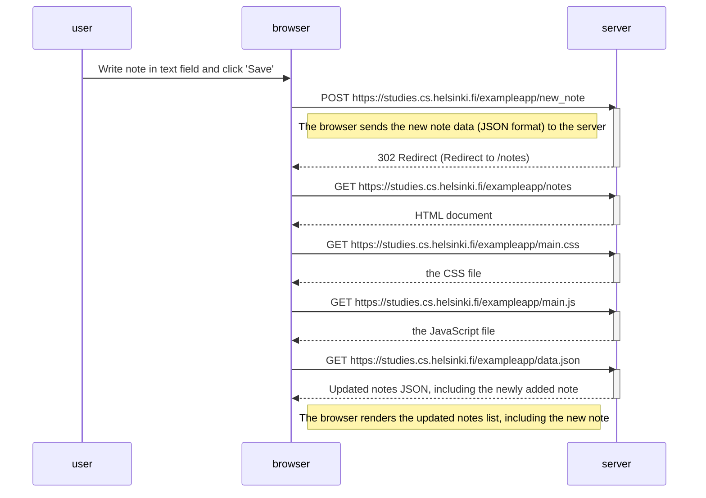

```mermaid
sequenceDiagram
    participant user
    participant browser
    participant server

    user->>browser: Write note in text field and click 'Save'

    browser->>server: POST https://studies.cs.helsinki.fi/exampleapp/new_note
    activate server
    Note right of browser: The browser sends the new note data (JSON format) to the server
    server-->>browser: 302 Redirect (Redirect to /notes)
    deactivate server

    browser->>server: GET https://studies.cs.helsinki.fi/exampleapp/notes
    activate server
    server-->>browser: HTML document
    deactivate server

    browser->>server: GET https://studies.cs.helsinki.fi/exampleapp/main.css
    activate server
    server-->>browser: the CSS file
    deactivate server

    browser->>server: GET https://studies.cs.helsinki.fi/exampleapp/main.js
    activate server
    server-->>browser: the JavaScript file
    deactivate server

    browser->>server: GET https://studies.cs.helsinki.fi/exampleapp/data.json
    activate server
    server-->>browser: Updated notes JSON, including the newly added note
    deactivate server

    Note right of browser: The browser renders the updated notes list, including the new note


```