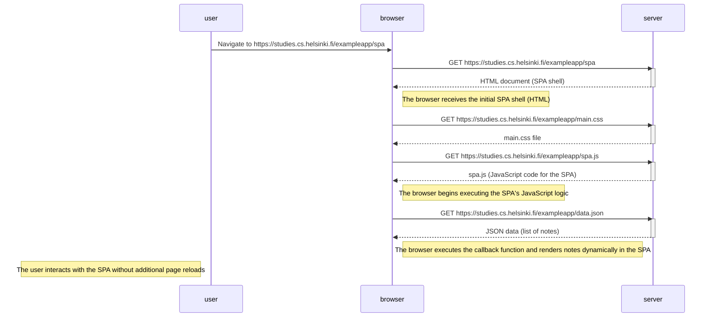

```mermaid
sequenceDiagram
    participant user
    participant browser
    participant server

    user->>browser: Navigate to https://studies.cs.helsinki.fi/exampleapp/spa
    browser->>server: GET https://studies.cs.helsinki.fi/exampleapp/spa
    activate server
    server-->>browser: HTML document (SPA shell)
    deactivate server

    Note right of browser: The browser receives the initial SPA shell (HTML) 

    browser->>server: GET https://studies.cs.helsinki.fi/exampleapp/main.css
    activate server
    server-->>browser: main.css file
    deactivate server

    browser->>server: GET https://studies.cs.helsinki.fi/exampleapp/spa.js
    activate server
    server-->>browser: spa.js (JavaScript code for the SPA)
    deactivate server

    Note right of browser: The browser begins executing the SPA's JavaScript logic

    browser->>server: GET https://studies.cs.helsinki.fi/exampleapp/data.json
    activate server
    server-->>browser: JSON data (list of notes)
    deactivate server

    Note right of browser: The browser executes the callback function and renders notes dynamically in the SPA

    Note left of user: The user interacts with the SPA without additional page reloads


```
