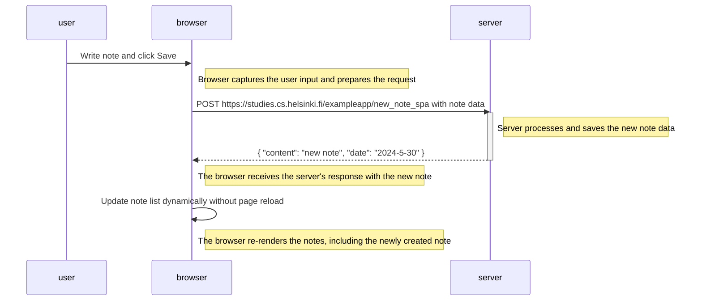

```mermaid
sequenceDiagram
    participant user
    participant browser
    participant server

    user->>browser: Write note and click Save
    Note right of browser: Browser captures the user input and prepares the request

    browser->>server: POST https://studies.cs.helsinki.fi/exampleapp/new_note_spa with note data
    activate server
    Note right of server: Server processes and saves the new note data
    server-->>browser: { "content": "new note", "date": "2024-5-30" }
    deactivate server

    Note right of browser: The browser receives the server's response with the new note

    browser->>browser: Update note list dynamically without page reload
    Note right of browser: The browser re-renders the notes, including the newly created note


```